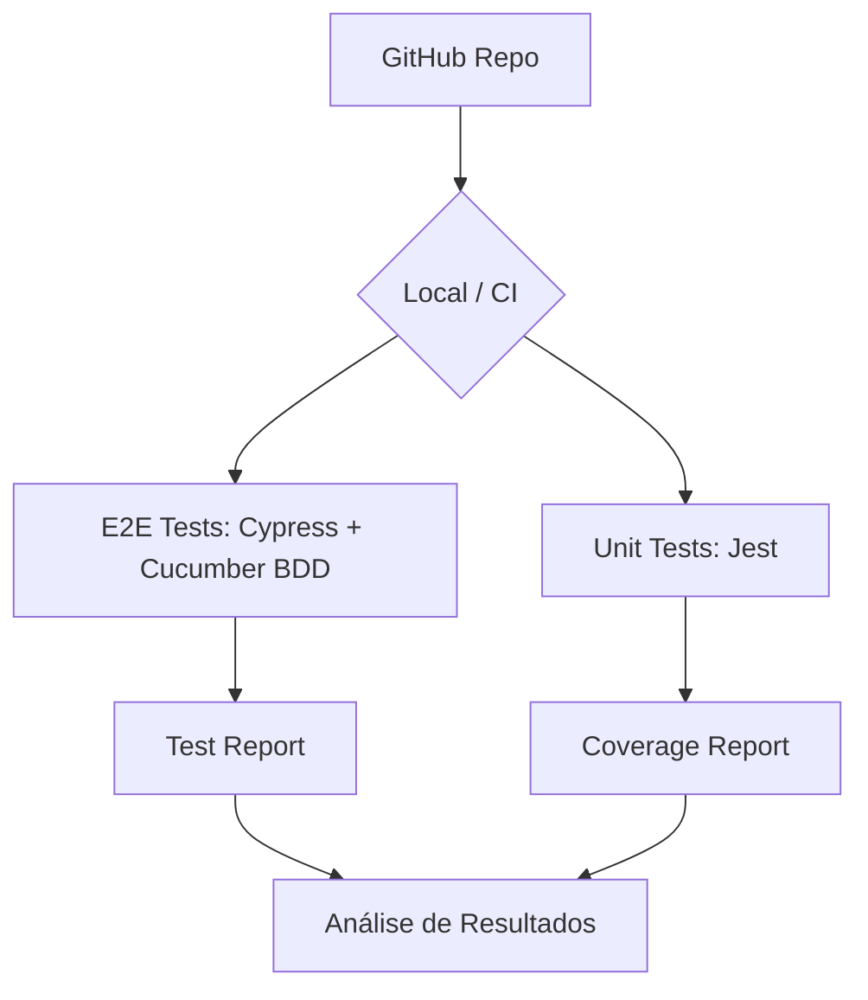

# 🌲 Cypress BDD — Automação E2E com Cypress + TypeScript + Cucumber


Projeto de automação de testes com **Cypress 13 + TypeScript + BDD (Cucumber/Gherkin)** e testes unitários com **Jest**, cobrindo cenários de UI e API REST.

---

## 🏗️ Arquitetura do Projeto



---

## 📋 Índice

- [Tecnologias Utilizadas](#-tecnologias-utilizadas)
- [Pré-requisitos](#-pré-requisitos)
- [Instalação e Configuração](#-instalação-e-configuração)
- [Executando os Testes](#-executando-os-testes)
- [Estrutura do Projeto](#-estrutura-do-projeto)
- [Casos de Teste Cobertos](#-casos-de-teste-cobertos)
- [Relatórios de Teste](#-relatórios-de-teste)

---

## 🛠 Tecnologias Utilizadas

| Tecnologia | Versão | Descrição |
|---|---|---|
| **Cypress** | 13.x | Framework de testes E2E |
| **Cucumber Preprocessor** | 21.x | BDD/Gherkin no Cypress |
| **TypeScript** | 5.x | Linguagem principal |
| **Jest** | 29.x | Testes unitários |
| **Node.js** | >= 18 | Runtime JavaScript |

---

## ✅ Pré-requisitos

- [Node.js](https://nodejs.org/) versão 18 ou superior
- [npm](https://www.npmjs.com/) (instalado junto com o Node.js)

---

## 🚀 Instalação e Configuração

1. **Clone o repositório:**
```bash
git clone https://github.com/Rafael-M-Sales/cypress-bdd-automation.git
cd cypress-bdd-automation
```

2. **Instale as dependências:**
```bash
npm install
```

---

## ▶️ Executando os Testes

### Testes E2E BDD (Cypress headless)
```bash
npm test
```

### Testes E2E BDD (Cypress com interface)
```bash
npm run test:headed
```

### Testes Unitários (Jest)
```bash
npm run test:unit
npm run test:unit:coverage   # com cobertura de código
```

---

## 📁 Estrutura do Projeto

```
cypress-bdd/
├── cypress/
│   ├── e2e/
│   │   ├── features/              # Arquivos .feature (Gherkin pt-BR)
│   │   │   ├── login.feature
│   │   │   └── api.feature
│   │   └── step_definitions/      # Step Definitions TypeScript
│   │       ├── login.steps.ts
│   │       └── api.steps.ts
│   ├── pages/                     # Page Objects
│   │   └── LoginPage.ts
│   ├── fixtures/                  # Dados de teste (JSON)
│   │   └── usuarios.json
│   └── support/                   # Suporte e custom commands
│       ├── commands.ts
│       └── e2e.ts
├── src/
│   └── utils/
│       ├── helpers.ts             # Funções utilitárias puras
│       └── helpers.test.ts        # Testes unitários Jest
├── cypress.config.ts
├── tsconfig.json
├── jest.config.ts
└── package.json
```

---

## 👨‍🏫 Foco Educativo e Didático

Este projeto segue as melhores práticas de engenharia de QA:
- **Page Object Model (POM)**: Separação clara entre a lógica de interação e os cenários de teste.
- **BDD em Português**: Cenários escritos em Gherkin pt-BR para facilitar a comunicação com stakeholders.
- **Testes Unitários**: Cobertura de funções utilitárias com Jest.
- **TypeScript**: Tipagem estática para maior segurança do código.

---

## 🧾 Casos de Teste Cobertos

### 🌐 Automação E2E

| # | Tag | Funcionalidade | Alvo |
|---|---|---|---|
| 1 | `@login` | Cenários de login | the-internet.herokuapp.com |
| 2 | `@api` | Testes de API REST | reqres.in |
| 3 | `@happy-path` | Fluxos de sucesso | - |
| 4 | `@sad-path` | Fluxos de erro | - |
| 5 | `@logout` | Cenários de logout | - |

---

## 👤 Autor

**Rafael M. Sales**

---

## 📄 Licença

Este projeto está sob a licença MIT.
